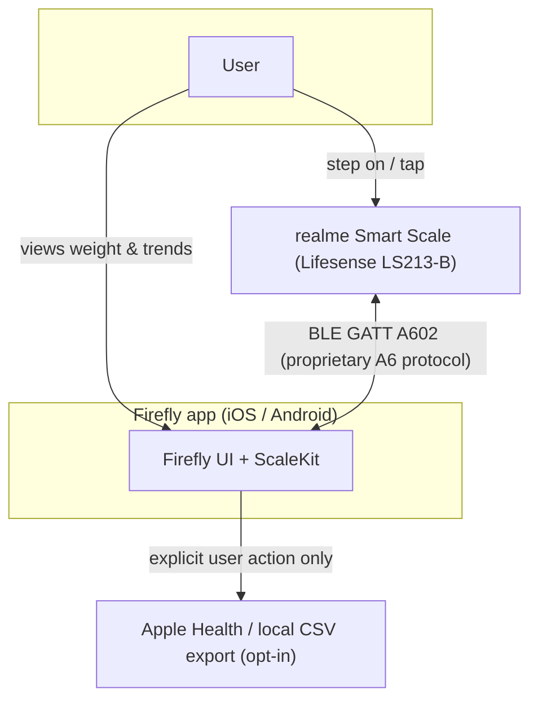
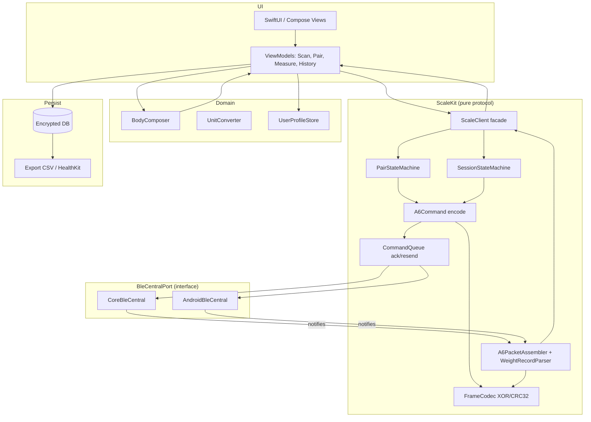
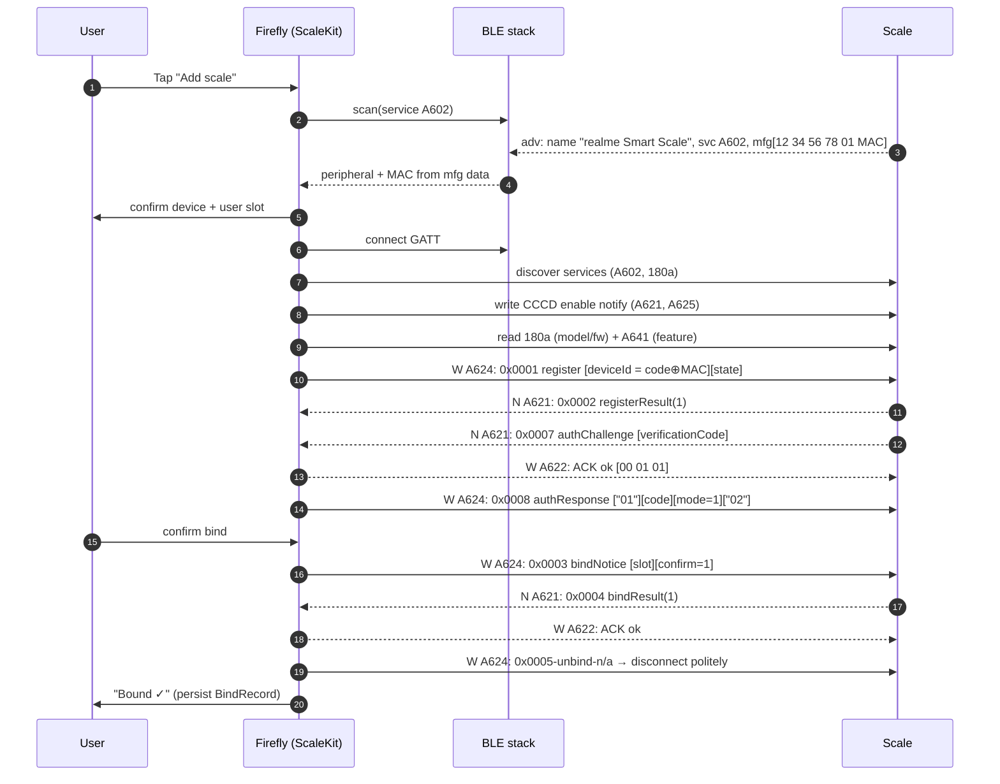
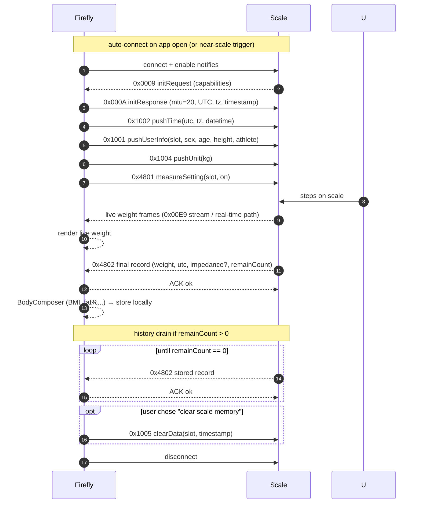
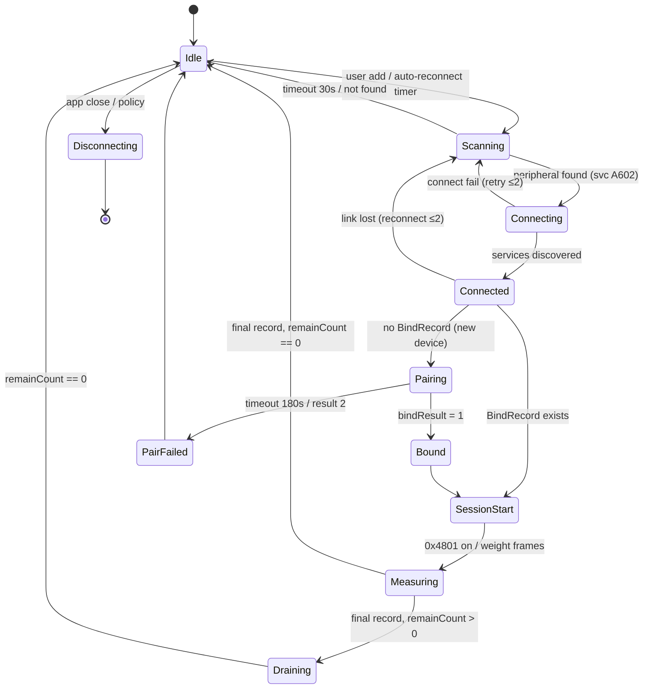
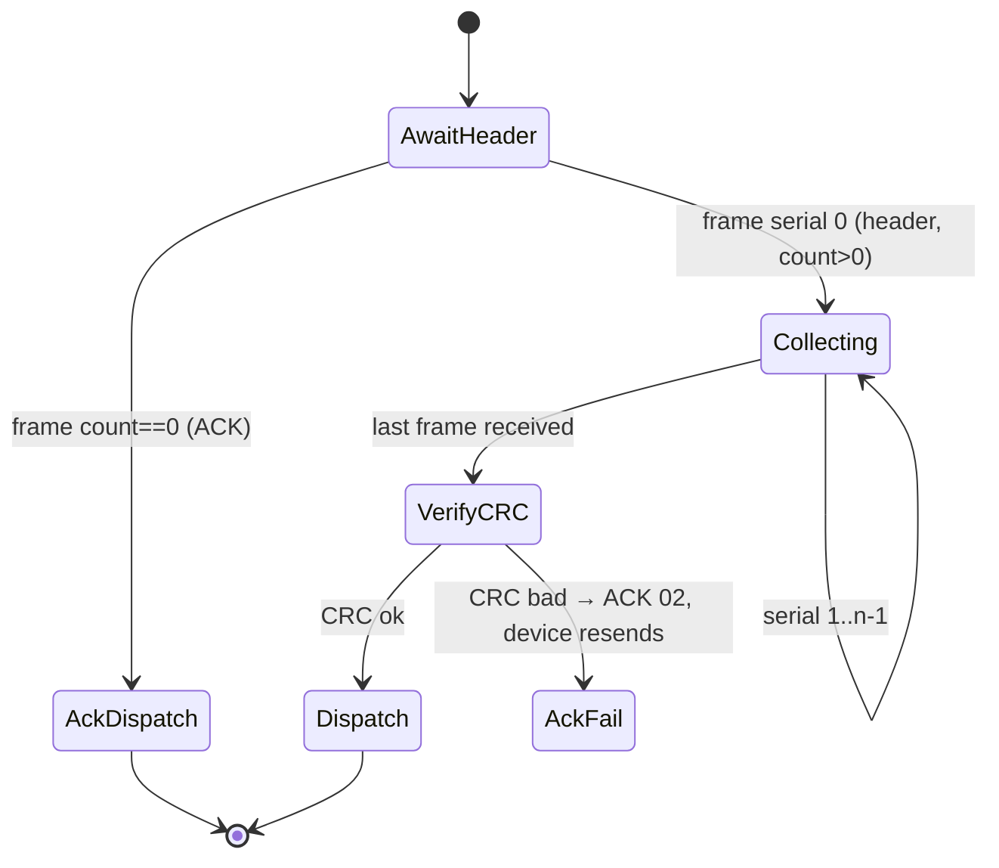
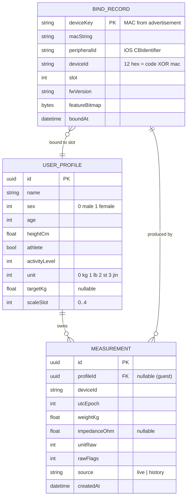
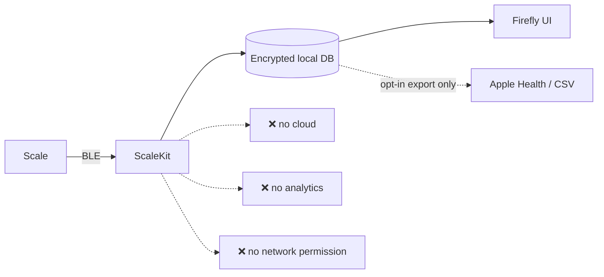
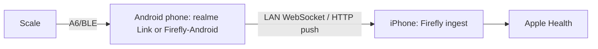

# Firefly — Diagrams

All diagrams are Mermaid (render on GitHub/VS Code).

## 1. System context (C4-L1)

## 2. Component view (C4-L2)

## 3. Sequence — discovery & binding (SRD-001/002)

## 4. Sequence — measurement session (SRD-003/004/005)

## 5. State machine — connection lifecycle

## 6. State machine — A6 frame reassembly

## 7. Entity-relationship (local store)

## 8. Privacy data-flow (what leaves the phone: nothing)

## 9. Android bridge (fallback path, Path C)

